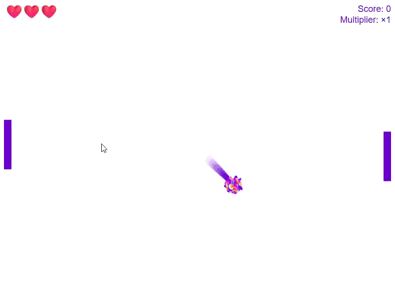

# Pong Game 🎮

A modern React + TypeScript remake of the classic Pong game.  
Features particle effects, screen shake, lives system, scoring with multipliers, and AI opponents with multiple difficulty levels.

---

## Demo

▶️ **Play here:** [make-a-pong.vercel.app](https://make-a-pong.vercel.app/)  



---

## How to Run

```bash
# Install dependencies
npm install

# Start development server
npm run dev

# Build for production
npm run build
```

---

## Notes

Pushing to the main branch automatically triggers a new build & deployment on Vercel.